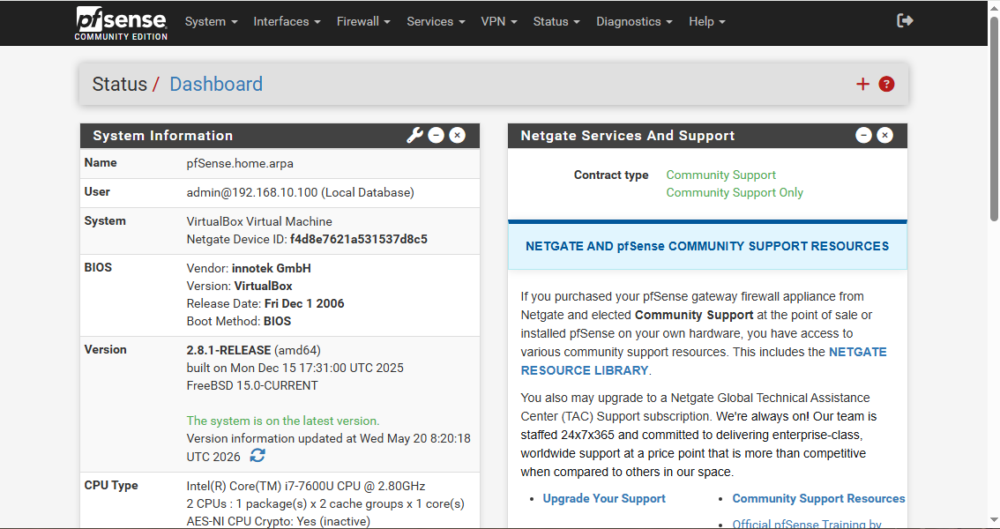
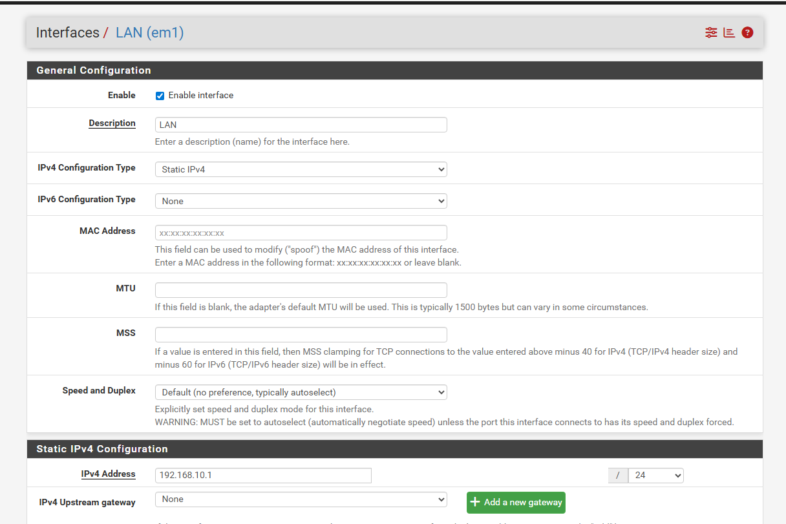
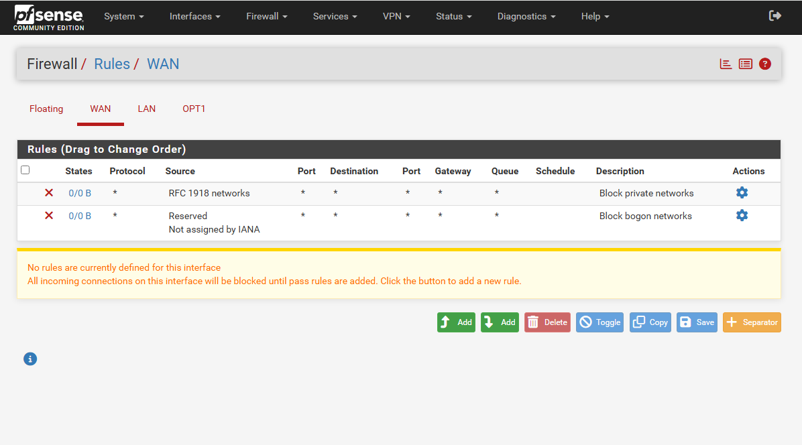
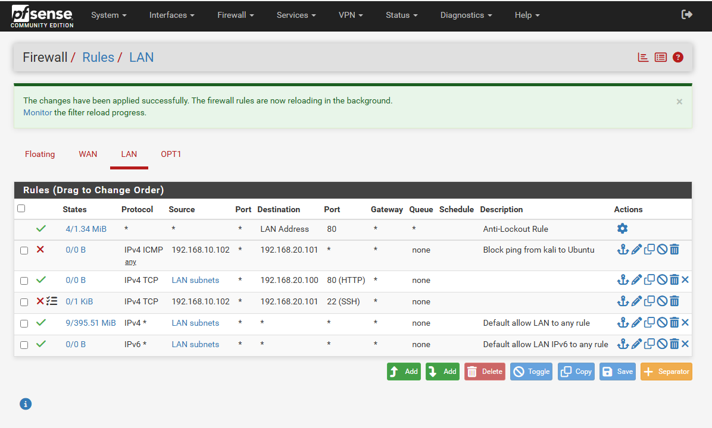
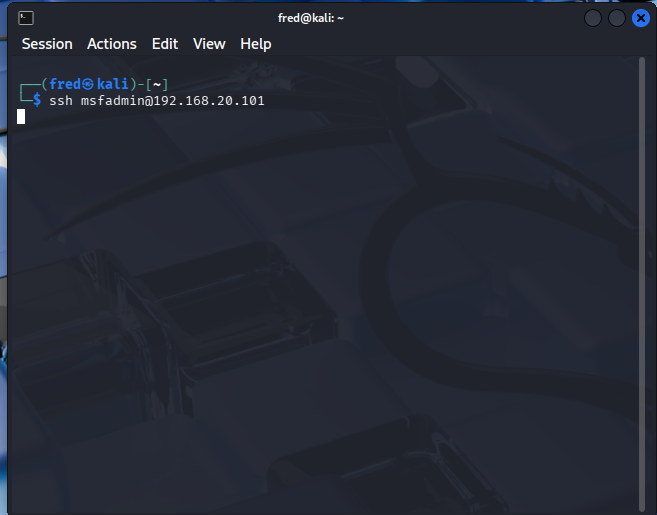
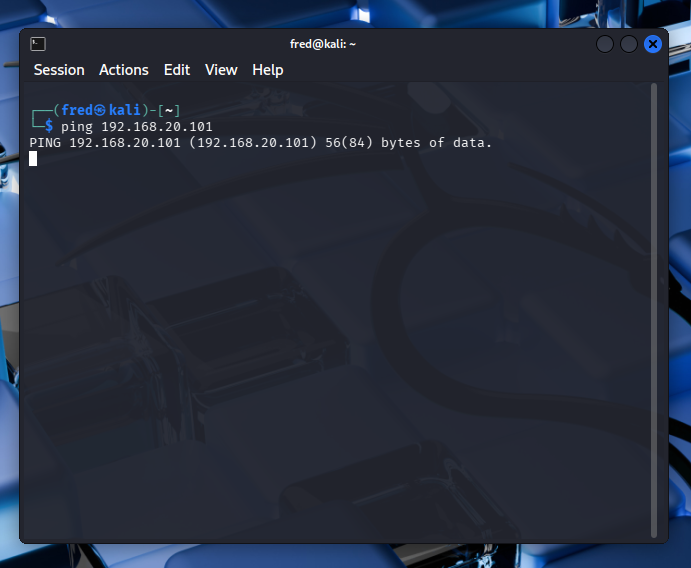
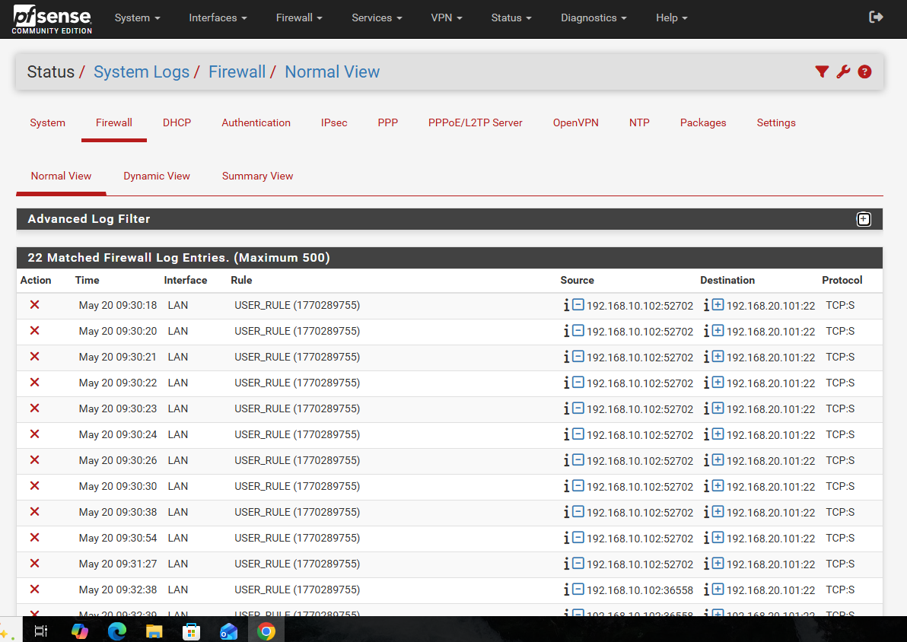

# pfSense Firewall Configuration & Testing
## Configuring and Verifying Real Firewall Rules

---

## Overview
This project covers hands-on pfSense firewall
configuration; writing real firewall rules,
fixing rule ordering issues, verifying rules
work correctly and analyzing firewall logs.
All testing was done using real VMs in a
homelab environment.

---

## Objectives
- Access and explore pfSense web interface
- Review existing WAN and LAN firewall rules
- Fix and activate SSH block rule
- Create new ICMP block rule from scratch
- Verify both rules work using real traffic
- Analyze blocked traffic in pfSense firewall logs

---

## Homelab Environment
| VM | IP Address | Role |
|---|---|---|
| pfSense | 192.168.10.1 | Firewall and router |
| Kali Linux | 192.168.10.102 | Attack platform |
| Ubuntu Server | 192.168.20.101 | Target server |
| Windows VM | 192.168.10.100 | Management machine |

---

## Firewall Rules Configured

### Rule 1 — Block SSH from Kali to Ubuntu
| Field | Value |
|---|---|
| Action | Block |
| Interface | LAN |
| Protocol | TCP |
| Source | 192.168.10.102 (Kali) |
| Destination | 192.168.20.101 (Ubuntu) |
| Port | 22 (SSH) |
| Description | Block SSH from Kali to Ubuntu |

### Rule 2 — Block ICMP from Kali to Ubuntu
| Field | Value |
|---|---|
| Action | Block |
| Interface | LAN |
| Protocol | ICMP |
| Source | 192.168.10.102 (Kali) |
| Destination | 192.168.20.101 (Ubuntu) |
| Description | Block ping from Kali to Ubuntu |

---

## Testing Methodology

### Test 1 — SSH Block Verification
Command run from Kali:
ssh msfadmin@192.168.20.101

Expected result: Connection timeout
Actual result: Connection hung with no response
Verdict: BLOCKED successfully

### Test 2 — ICMP Block Verification
Command run from Kali:
ping 192.168.20.101

Expected result: No ping responses
Actual result: Zero replies after 5 minutes
Verdict: BLOCKED successfully

---

## Results

### pfSense Dashboard

### LAN Interface Configuration

### WAN Firewall Rules

### LAN Firewall Rules

### SSH Blocked — Connection Timeout

### Ping Blocked — No Response

### Firewall Logs — Blocked Traffic

---

## Analysis

### Finding 1 — BLOCK vs REJECT Behaviour
pfSense BLOCK action silently drops packets:
- SSH attempt hung with no response
- Ping received zero replies after 5 minutes
- Attacker gets no information about why it failed

This is more secure than REJECT which sends
an immediate refusal, giving attackers
confirmation that a firewall exists.

### Finding 2 — Firewall Logs Confirmed Blocking
22 blocked log entries were recorded showing:
- Source: 192.168.10.102 (Kali)
- Destination: 192.168.20.101 (Ubuntu)
- Protocol: TCP-S (SYN packets being dropped)
- Rule: USER_RULE (our custom block rule)

TCP-S means pfSense blocked the TCP SYN packet
before the connection was even established, which is the most efficient point to block traffic.

### Finding 3 — WAN Default Security
Two default WAN rules were already in place:
- Block RFC 1918 private networks — prevents IP spoofing
- Block bogon networks — blocks reserved IP ranges

These are critical anti-spoofing measures that
prevent attackers from faking internal IP addresses.

---

## Security Lessons Learned

| Lesson | Explanation |
|---|---|
| Rule order matters | First match wins — block rules must be above allow rules |
| BLOCK vs REJECT | BLOCK gives attackers less information |
| Firewall logging | Every blocked attempt is recorded with timestamp |
| Default deny | Block all rule at bottom catches everything else |
| TCP-S blocking | Block at SYN = most efficient — connection never established |

---

## Conclusion
Successfully configured and verified two firewall
rules in pfSense blocking SSH and ICMP traffic
from Kali Linux to Ubuntu Server. Firewall logs
confirmed 22 blocked SSH attempts. Key lesson
learned is that the rule order is critical in pfSense as
rules are evaluated top to bottom with first
match winning.

---

## 🔗 Related Projects
- [pfSense Firewall Deep Dive](https://github.com/Phredreeq/pfsense-firewall-deep-dive)
- [Firewall Log Analysis](https://github.com/Phredreeq/firewall-log-analysis)
- [Network Traffic Analysis](https://github.com/Phredreeq/network-traffic-analysis-wireshark)

---

## 👤 Author
Fredrick Agufenwa

Cybersecurity Student | SOC & Threat Detection
